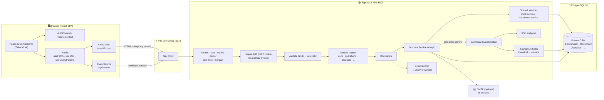
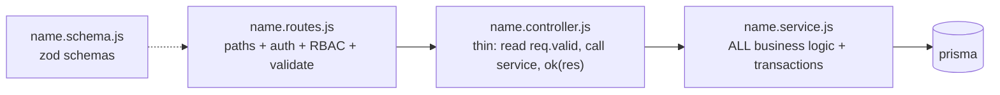
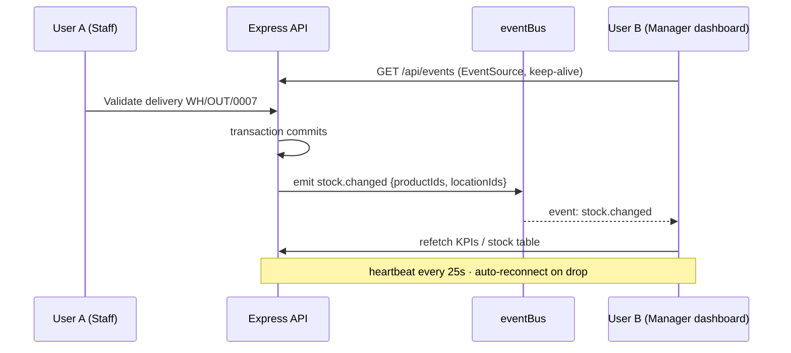
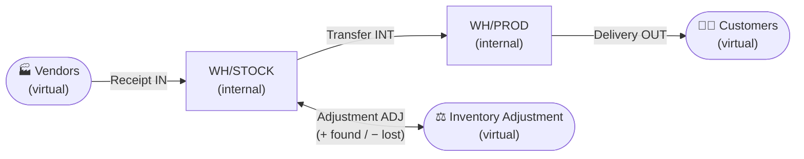
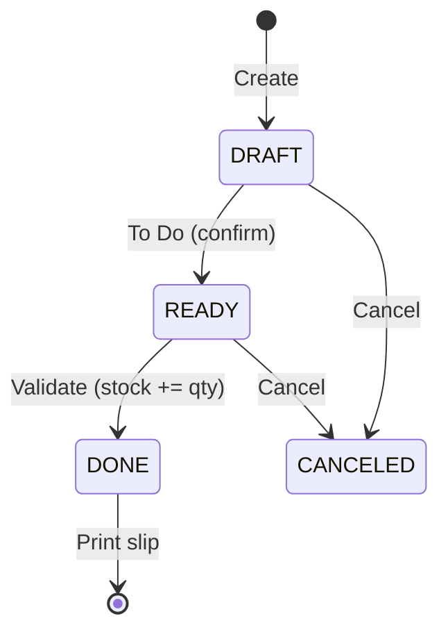
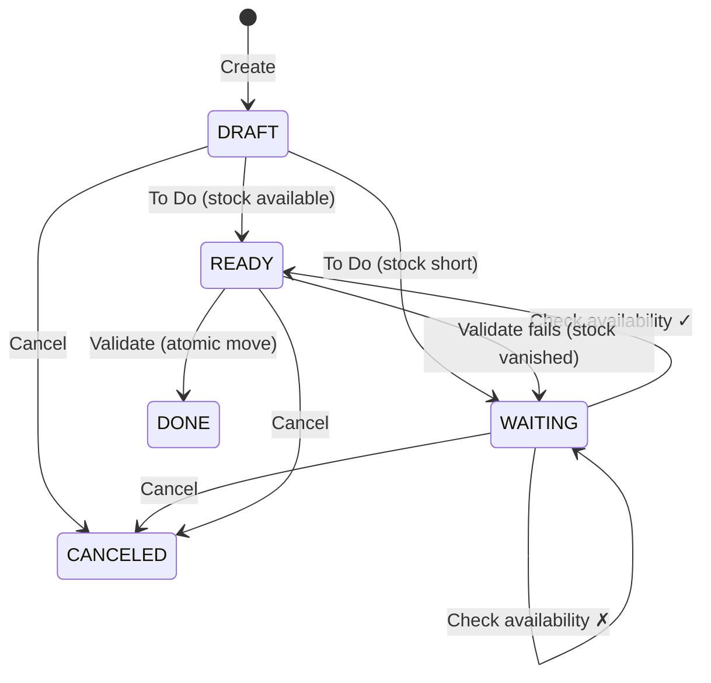
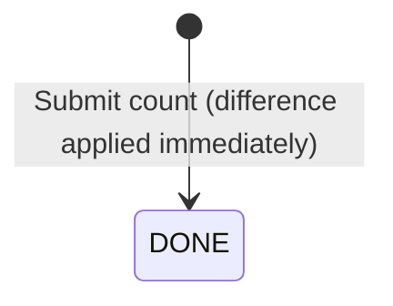
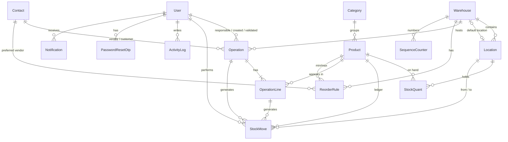

<div align="center">

# 📦 StockSense

### Real-time Inventory Management System

Replace manual registers and Excel sheets with one centralized, real-time, audit-ready inventory platform.


[Features](#-features) •
[Architecture](#-architecture) •
[Tech Stack](#-technology-stack) •
[Getting Started](#-getting-started) •
[API](#-api-overview) •
[Docs](#-documentation)

</div>

---

## 📑 Table of Contents

1. [Overview](#-overview)
2. [Problem & Solution](#-problem--solution)
3. [Features](#-features)
4. [Additional (Smart) Features](#-additional-smart-features)
5. [Technology Stack](#-technology-stack)
6. [Architecture](#-architecture)
7. [Stock Engine (How Inventory Is Counted)](#-stock-engine-how-inventory-is-counted)
8. [Operation Lifecycles](#-operation-lifecycles)
9. [Data Model](#-data-model)
10. [Roles & Permissions](#-roles--permissions)
11. [API Overview](#-api-overview)
12. [Project Structure](#-project-structure)
13. [Getting Started](#-getting-started)
14. [Environment Variables](#-environment-variables)
15. [Scripts](#-scripts)
16. [Demo Credentials & Walkthrough](#-demo-credentials--walkthrough)
17. [Design System](#-design-system)
18. [Security](#-security)
19. [Troubleshooting](#-troubleshooting)
20. [Roadmap](#-roadmap)
21. [Team & Ownership](#-team--ownership)
22. [Documentation](#-documentation)

---

## 🧭 Overview

**StockSense** is a full-stack inventory management system built by a 3-person team in an 8-hour hackathon. It tracks every unit of stock across **multiple warehouses and locations**, from receiving goods from vendors to internal transfers, customer deliveries and physical-count adjustments. Every movement is recorded in an **immutable ledger**, and all connected users see updates **in real time**.

| | |
| :--- | :--- |
| **Type** | Web application (monorepo: React client + Node/Express REST API) |
| **Users** | Inventory Managers, Warehouse Staff, Administrators |
| **Core idea** | Quant (current balance) + immutable move ledger (full history) |
| **Real-time** | Server-Sent Events (SSE) push stock and operation changes to every open tab |
| **Offline-friendly** | No cloud dependency: local PostgreSQL, self-hosted fonts, OTP printed to the console when no SMTP is set |

---

## 🎯 Problem & Solution

| Problem (manual registers / Excel) | StockSense solution |
| :--- | :--- |
| Stock numbers drift; nobody knows the real on-hand quantity | **Quant model** with atomic updates; stock can never go negative |
| No history of who moved what, when | **Immutable ledger** (`StockMove`) plus an **activity/audit log** |
| Multiple warehouses tracked in separate sheets | **Multi-warehouse, multi-location** hierarchy (Warehouse → Rooms/Racks/Floors) |
| Stock-outs discovered too late | **Low-stock / out-of-stock alerts**, reorder rules and a **replenishment** page |
| Delayed or forgotten deliveries | **Late-operation** detection on the dashboard and in notifications |
| Everyone sees a stale copy | **Real-time updates** via SSE across all users |
| Anyone can edit anything | **Role-based access control**, enforced in backend middleware |

---

## ✨ Features

### Core modules

| Module | What it does | Key details |
| :--- | :--- | :--- |
| 🔐 **Authentication** | Sign up, log in, logout, OTP password reset, profile | Login ID 6–12 chars (unique); email unique; password > 8 chars with lowercase, uppercase and a special character; httpOnly JWT cookie (8h) |
| 📊 **Dashboard** | KPIs and operation cards | Total products in stock, low/out-of-stock, pending receipts/deliveries, scheduled transfers; **"N to receive / X late / Y operations"** cards; 30-day trends; top products; filters by type, status, warehouse/location, category |
| 📦 **Products** | Product catalog | Name, SKU (unique, uppercase), category, unit of measure, cost/sale price, barcode, optional initial stock; per-location stock and ledger on the detail page |
| 🏷️ **Categories** | Group products | CRUD with unique names |
| 📥 **Receipts** (IN) | Incoming goods from vendors | Draft → Ready → Done; **To Do / Validate / Print / Cancel** buttons; responsible user auto-filled |
| 📤 **Deliveries** (OUT) | Outgoing goods to customers | Draft → Waiting → Ready → Done; **lines turn red with an alert when stock is short** |
| 🔁 **Internal Transfers** (INT) | Move stock between locations | Source → destination within or across warehouses |
| ⚖️ **Inventory Adjustments** (ADJ) | Physical counts | Enter the counted quantity; the system computes the difference and posts it immediately (Done) with a reason (Damaged, Lost, Found, Count correction, Other) |
| 📜 **Move History** | Stock ledger | One row per product line; **incoming rows green, outgoing rows red**; search, list/kanban, CSV export |
| 🧮 **Stock** | Stock overview | Product, per-unit cost, **On Hand**, **Free to Use**, value; filter by warehouse/location/category |
| 👥 **Contacts** | Vendors and customers | Type (Vendor / Customer / Both), email, 10-digit phone, address, GSTIN validation |
| 🏭 **Warehouses** | Warehouse master data | Name, unique short code (e.g. `WH`), address, default location; soft delete blocked while stock exists |
| 📍 **Locations** | Rooms, racks, floors | Name, short code, warehouse; full name like `WH/STOCK` |
| 🛡️ **Users** (Admin) | User management | Change role, activate/deactivate; cannot demote or deactivate yourself |
| 🕵️ **Activity Log** | Audit trail | Filter by user, entity and date |

### Operation references

References are auto-generated **per warehouse and per operation type**, formatted `<WarehouseCode>/<TYPE>/<0001>`:

| Operation | Prefix | Example |
| :--- | :--- | :--- |
| Receipt | `IN` | `WH/IN/0001` |
| Delivery | `OUT` | `WH/OUT/0001` |
| Internal transfer | `INT` | `WH2/INT/0001` |
| Adjustment | `ADJ` | `WH/ADJ/0001` |

### List-page conventions (all operation lists)

- Default **List view**; toggle to **Kanban** grouped by status.
- Columns: *Reference, From, To, Contact, Scheduled Date, Status*.
- Search by **reference** and **contact**; filter chips; **Late only** toggle.
- URL-synced filters (`?status=READY&late=true&view=kanban`), so the dashboard deep-links into pre-filtered lists.
- Every data view has **loading** (skeletons), **empty** (icon, message, call to action), **error** (message plus Retry) and **success** (toast) states.

---

## 🚀 Additional (Smart) Features

| # | Feature | Description | Priority |
| :-: | :--- | :--- | :-: |
| 1 | **Role-based access** | ADMIN / MANAGER / STAFF enforced in Express middleware (never UI-only) | P0 |
| 2 | **Real-time updates (SSE)** | `stock.changed`, `operation.changed` and `notification.created` pushed to all tabs, with auto-reconnect | P0 |
| 3 | **Notification center** | Bell with low-stock, out-of-stock and late-operation alerts; mark as read / read all | P1 |
| 4 | **Replenishment** | Suggests quantities from min/max **reorder rules** and creates draft receipts | P1 |
| 5 | **Command palette (Ctrl+K)** | Global search over SKU, product name, operation reference and contact | P1 |
| 6 | **CSV import / export** | Bulk product import; export products, stock and moves | P1 |
| 7 | **Printable slips** | Print-ready receipt and delivery slips (`/operations/:id/print`) | P1 |
| 8 | **Product detail** | Per-location stock breakdown plus the product's own ledger | P1 |
| 9 | **Stock valuation** | On-hand × unit cost per product and in total (₹, en-IN formatting) | P1 |
| 10 | **Activity / audit log** | Every create, update, validate and cancel is recorded with user and metadata | P1 |
| 11 | **Dark / light / system theme** | Class-based dark mode, persisted in `localStorage`, no flash on load | P2 |
| 12 | **Barcode (keyboard-wedge) support** | Scan a SKU into search or a product line, then press Enter to select it | P2 |
| 13 | **Offline-first** | Self-hosted fonts, no CDNs, local database, OTP via console fallback | P2 |
| 14 | **Background jobs** | Periodic and event-driven scans create low-stock and late-operation notifications | P1 |
| 15 | **Reservation logic** | *Free to Use = On Hand − stock reserved by READY deliveries and transfers* | P0 |

---

## 🧰 Technology Stack

### Frontend

| Technology | Purpose |
| :--- | :--- |
| **React 19** + **Vite 8** (JavaScript) | UI library and lightning-fast dev server / bundler |
| **React Router** | Client-side routing, protected and role-guarded routes |
| **Tailwind CSS v4** (`@tailwindcss/vite`) | Utility-first styling with `@theme` design tokens |
| **Axios** | HTTP client with an envelope-unwrapping interceptor and 401 redirect |
| **react-hook-form** + **zod** + `@hookform/resolvers` | Forms with client-side validation that mirrors the server rules |
| **lucide-react** | Icon set |
| **recharts** | Dashboard charts |
| **sonner** | Toast notifications |
| **clsx** | Conditional class names |
| **papaparse** | CSV parsing for bulk import |
| **@fontsource-variable/inter**, **@fontsource/jetbrains-mono** | Self-hosted fonts (Inter for UI, JetBrains Mono for SKUs, references and numbers) |

### Backend

| Technology | Purpose |
| :--- | :--- |
| **Node.js** (ESM) + **Express 5** | REST API with native async error handling |
| **Prisma ORM 7** + `@prisma/adapter-pg` | Type-safe data access, migrations, seed |
| **PostgreSQL 18** | Relational database with `Decimal` quantities and transactional integrity |
| **Zod** | Request validation (body, query, params) and fail-fast env validation |
| **jsonwebtoken** + **bcrypt** | JWT sessions in an httpOnly cookie; password and OTP hashing (12 rounds) |
| **helmet**, **cors**, **cookie-parser** | Security headers, CORS with credentials, cookie parsing |
| **express-rate-limit** | Throttling for auth and OTP endpoints and the general API |
| **morgan** | HTTP request logging in development |
| **nodemailer** | OTP emails via SMTP (optional; falls back to the console) |
| **dotenv** | Environment loading |

### Tooling

| Tool | Purpose |
| :--- | :--- |
| **npm workspaces** | One `npm install` for `server/` and `client/` |
| **concurrently** | `npm run dev` starts API and client together |
| **ESLint** (flat config) | Linting for both apps |
| **Prisma Studio** | Visual database browser (`npm run db:studio`) |

---

## 🏗 Architecture

### System diagram



### Backend layering

Every module under `server/src/modules/<name>/` follows the same four files:



| Layer | Responsibility | Must NOT |
| :--- | :--- | :--- |
| **Routes** | Declare endpoints, attach `requireAuth`, `requireRole`, `validate` | Contain logic |
| **Controller** | Read `req.valid`, call the service, send `{ success, data, meta }` | Touch Prisma directly |
| **Service** | Business rules, transactions, activity logging, event emission | Know about `req` / `res` |
| **Shared services** | `applyMoves`, `checkAvailability`, `nextReference` | Emit events (callers do, after commit) |

### Request lifecycle

```mermaid
sequenceDiagram
    autonumber
    participant B as Browser
    participant V as Vite proxy
    participant E as Express
    participant A as requireAuth/requireRole
    participant Z as validate (zod)
    participant S as Service
    participant D as PostgreSQL
    participant Bus as eventBus / SSE

    B->>V: POST /api/operations/:id/validate (cookie: token)
    V->>E: forward
    E->>A: verify JWT, load user, check role
    A-->>E: 401 / 403 on failure
    E->>Z: parse params/body → req.valid
    Z-->>E: 400 VALIDATION_ERROR on failure
    E->>S: validate(userId, id)
    S->>D: BEGIN; claim READY→DONE; applyMoves; log activity; COMMIT
    D-->>S: ok (or rollback → 409 INSUFFICIENT_STOCK)
    S->>Bus: emit operation.changed + stock.changed
    Bus-->>B: SSE push to every open tab
    S-->>B: { success: true, data: operation }
```

### Response envelope

```jsonc
// Success
{ "success": true, "data": { /* ... */ }, "meta": { "page": 1, "limit": 20, "total": 57, "totalPages": 3 } }

// Error
{ "success": false, "error": { "code": "INSUFFICIENT_STOCK", "message": "Not enough stock for Steel Rod: required 20, available 5", "details": [ /* per line */ ] } }
```

| HTTP | Code | When |
| :-: | :--- | :--- |
| 400 | `VALIDATION_ERROR` | Zod validation failed (field-level `details`) |
| 401 | `UNAUTHORIZED` | Missing, expired or invalid session |
| 403 | `FORBIDDEN` | Role not allowed |
| 404 | `NOT_FOUND` | Unknown resource or route |
| 409 | `CONFLICT` | Unique constraint (e.g. duplicate SKU or short code) |
| 409 | `INSUFFICIENT_STOCK` | A move would make stock negative |
| 409 | `INVALID_STATE` | Action not allowed in the current status |
| 429 | `RATE_LIMITED` | Too many requests |

### Real-time flow (SSE)



---

## 🧮 Stock Engine (How Inventory Is Counted)

StockSense uses a **double-entry style** model: every movement goes *from* one location *to* another.



| Concept | Meaning |
| :--- | :--- |
| **StockQuant** | Current on-hand quantity of a product in an **internal** location (unique per product + location) |
| **StockMove** | Immutable ledger row: product, from → to, positive quantity, unit cost, user, reference |
| **Virtual locations** | `VENDOR`, `CUSTOMER`, `ADJUSTMENT`: sources and sinks that are **never counted** as stock |
| **On Hand** | Sum of quants in internal locations |
| **Reserved** | Sum of line quantities of **READY** deliveries and transfers leaving that location |
| **Free to Use** | `On Hand − Reserved` |
| **Negative-stock guard** | Atomic conditional decrement: `UPDATE ... WHERE quantity >= qty`. If no row matches, the whole transaction rolls back with `INSUFFICIENT_STOCK` |
| **Decimal quantities** | `Decimal(14,3)` for quantities (kg, m, L); `Decimal(12,2)` for money |

### End-to-end example (from the PRD)

| Step | Operation | From → To | Qty | WH/STOCK | WH/PROD |
| :-: | :--- | :--- | --: | --: | --: |
| 1 | Receive steel from vendor `WH/IN/0001` | Vendors → WH/STOCK | 100 kg | **100** | 0 |
| 2 | Transfer to production rack `WH/INT/0001` | WH/STOCK → WH/PROD | 100 kg | 0 | **100** |
| 3 | Deliver to customer `WH/OUT/0001` | WH/PROD → Customers | 20 kg | 0 | **80** |
| 4 | Adjust damaged `WH/ADJ/0001` | WH/PROD → Inventory Adjustment | 3 kg | 0 | **77** |

All four steps appear in **Move History** as ledger rows: green for IN and red for OUT.

---

## 🔄 Operation Lifecycles

### Receipt



### Delivery & internal transfer



### Inventory adjustment



### Dashboard definitions

| Term | Rule |
| :--- | :--- |
| **Late** | `scheduledDate < today` **and** status not Done/Canceled |
| **Operations** (upcoming) | `scheduledDate > today` |
| **Waiting** | Delivery/transfer waiting for stock |
| **To receive / To deliver** | Receipts / deliveries in Ready |

---

## 🗃 Data Model



| Model | Purpose | Notable fields |
| :--- | :--- | :--- |
| `User` | Accounts | `loginId` (unique), `email` (unique), `role`, `isActive`, `lastLoginAt` |
| `PasswordResetOtp` | OTP reset | bcrypt `otpHash`, `expiresAt` (10 min), `attempts` (max 5), `usedAt` |
| `Warehouse` | Site | `shortCode` (unique, uppercase), `defaultLocationId` |
| `Location` | Room/rack/floor or virtual | `type` (INTERNAL/VENDOR/CUSTOMER/ADJUSTMENT), unique `(warehouseId, shortCode)` |
| `Category` | Product grouping | `name` (unique) |
| `Product` | Catalog item | `sku` (unique), `uom`, `costPrice`, `salePrice`, `barcode` |
| `ReorderRule` | Replenishment | `minQty`, `maxQty`, `preferredVendorId`, unique `(productId, warehouseId)` |
| `Contact` | Vendor / customer | `type`, `gstin`, `phone` |
| `StockQuant` | Current balance | unique `(productId, locationId)` |
| `Operation` | Receipt/delivery/transfer/adjustment | `reference` (unique), `type`, `status`, `scheduledDate` |
| `OperationLine` | Product line | `quantity`, `theoreticalQuantity`, `countedQuantity` |
| `StockMove` | **Immutable ledger** | `reference`, `fromLocationId`, `toLocationId`, `quantity > 0`, `unitCost` |
| `SequenceCounter` | Reference numbering | unique `(warehouseId, type)`, atomic `INSERT … ON CONFLICT` increment |
| `Notification` | Alerts | `type`, `userId` (null = broadcast), `readAt` |
| `ActivityLog` | Audit | `action`, `entityType`, `entityId`, `metadata` (JSON) |

---

## 🛡 Roles & Permissions

Authorization is enforced by the `requireRole` middleware on the server. The UI only hides what the API already forbids.

| Capability | ADMIN | MANAGER | STAFF |
| :--- | :-: | :-: | :-: |
| View everything (dashboard, stock, moves, lists) | ✅ | ✅ | ✅ |
| Create / edit / confirm / validate receipts, deliveries, transfers | ✅ | ✅ | ✅ |
| Submit inventory adjustments (counting) | ✅ | ✅ | ✅ |
| Cancel operations | ✅ | ✅ | ❌ |
| Delete (draft operations, master data) | ✅ | ✅ | ❌ |
| Manage products, categories, contacts, reorder rules | ✅ | ✅ | ❌ |
| Manage warehouses & locations | ✅ | ✅ | ❌ |
| Manage users (roles, activation) | ✅ | ❌ | ❌ |

New sign-ups are always **STAFF**. The seed creates the first admin, and admins can promote users.

---

## 🔌 API Overview

Base URL: `/api`. All routes except auth and health require the `token` cookie. See [`docs/API.md`](docs/API.md) for full request and response schemas.

| Module | Endpoints |
| :--- | :--- |
| **Health** | `GET /health` |
| **Auth** | `POST /auth/register` · `POST /auth/login` · `POST /auth/logout` · `GET /auth/me` · `PATCH /auth/me` · `PATCH /auth/me/password` · `POST /auth/forgot-password` · `POST /auth/verify-otp` · `POST /auth/reset-password` |
| **Users** (admin) | `GET /users` · `PATCH /users/:id` |
| **Warehouses** | `GET /warehouses` · `POST /warehouses` · `GET /warehouses/:id` · `PATCH /warehouses/:id` · `DELETE /warehouses/:id` |
| **Locations** | `GET /locations?warehouseId&type` · `POST /locations` · `PATCH /locations/:id` · `DELETE /locations/:id` |
| **Contacts** | `GET /contacts?type&search&page` · `POST` · `GET /:id` · `PATCH /:id` · `DELETE /:id` |
| **Operations** | `GET /operations?type&status&warehouseId&locationId&contactId&search&late&dateFrom&dateTo&page&limit&sort` · `GET /operations/board?type` · `POST` · `GET /:id` · `PATCH /:id` · `DELETE /:id` · `POST /:id/confirm` · `POST /:id/check-availability` · `POST /:id/validate` · `POST /:id/cancel` |
| **Adjustments** | `GET /adjustments` · `GET /adjustments/:id` · `GET /adjustments/on-hand` · `POST /adjustments` |
| **Categories** | `GET` · `POST` · `GET /:id` · `PATCH /:id` · `DELETE /:id` |
| **Products** | `GET /products?search&categoryId&stockStatus&page` · `POST` · `GET /:id` · `PATCH /:id` · `DELETE /:id` · `GET /:id/stock` · `GET /:id/moves` · `POST /bulk` · `GET /export` |
| **Reorder rules** | `GET` · `POST` · `GET /:id` · `PATCH /:id` · `DELETE /:id` |
| **Stock** | `GET /stock?warehouseId&locationId&categoryId&search` · `GET /stock/export` |
| **Moves** | `GET /moves?search&type&productId&locationId&dateFrom&dateTo&page` · `GET /moves/board` · `GET /moves/export` |
| **Dashboard** | `GET /dashboard/summary` · `GET /dashboard/operation-cards` · `GET /dashboard/trends?days=30` · `GET /dashboard/top-products` |
| **Replenishment** | `GET /replenishment` |
| **Notifications** | `GET /notifications` · `PATCH /notifications/:id/read` · `POST /notifications/read-all` |
| **Search** | `GET /search?q=` |
| **Events (SSE)** | `GET /events` |
| **Activity** | `GET /activity` |

---

## 📁 Project Structure

```text
Odoo_stockSense/
├── package.json              # npm workspaces + root scripts (dev, db:*, lint, build)
├── docs/                     # PRD, DESIGN, ARCHITECTURE, API, DECISIONS, CONTRIBUTING, PROGRESS
├── server/
│   ├── prisma/
│   │   ├── schema.prisma     # complete data model
│   │   ├── migrations/       # never edit old migrations — add new ones
│   │   ├── seed.js           # idempotent: users, virtual locations, warehouses
│   │   └── seed-demo.js      # rich demo data: categories, products, contacts, history
│   ├── prisma.config.js      # Prisma 7 config (datasource url, seed command)
│   └── src/
│       ├── server.js         # listen + start background jobs + graceful shutdown
│       ├── app.js            # middleware chain, /api/health, routes, errors
│       ├── routes.js         # mounts every module under /api
│       ├── config/env.js     # zod-validated env (fail fast)
│       ├── lib/              # prisma, errors, eventBus, activity, pagination, serialize, mailer
│       ├── middleware/       # auth, rbac, validate, errorHandler, notFound, rateLimit
│       ├── services/         # stock.service.js, sequence.service.js
│       ├── jobs/             # low-stock & late-operation scanners
│       └── modules/<name>/   # <name>.routes / .controller / .service / .schema
└── client/
    ├── vite.config.js        # React + Tailwind plugins, /api proxy → :5000
    └── src/
        ├── main.jsx · App.jsx · router.jsx · index.css (@theme tokens)
        ├── api/              # axios client + one file per module
        ├── context/          # AuthContext, ThemeContext
        ├── hooks/            # useFetch, useDebounce, useSSE, useQueryParams
        ├── components/
        │   ├── ui/           # 30+ accessible components (see ui/README.md)
        │   ├── layout/       # AppLayout, Sidebar, Topbar, AuthLayout
        │   ├── operations/   # OperationListPage, OperationForm, LinesEditor
        │   ├── notifications/ · search/
        ├── pages/            # auth, dashboard, operations, products, stock, moves,
        │                     # replenishment, contacts, settings, profile
        ├── constants/        # status, roles, routes
        └── utils/format.js   # en-IN numbers, ₹ currency, dates
```

### Frontend routes

| Route | Page | Access |
| :--- | :--- | :--- |
| `/login`, `/signup`, `/forgot-password`, `/reset-password` | Auth | Public |
| `/dashboard` | KPIs, operation cards, trends | All |
| `/operations/receipts[/new\|/:id]` | Receipts | All |
| `/operations/deliveries[/new\|/:id]` | Deliveries | All |
| `/operations/transfers[/new\|/:id]` | Internal transfers | All |
| `/operations/adjustments[/new\|/:id]` | Adjustments | All |
| `/operations/:id/print` | Printable slip (no layout) | All |
| `/products[/new\|/:id]`, `/products/categories` | Catalog | All (edit: Admin/Manager) |
| `/stock`, `/moves`, `/replenishment` | Stock, ledger, replenishment | All |
| `/contacts` | Vendors & customers | All (edit: Admin/Manager) |
| `/settings/warehouses`, `/settings/locations`, `/settings/activity` | Settings | All (edit: Admin/Manager) |
| `/settings/users` | User management | **Admin** |
| `/profile` | My profile & password | All |

---

## ⚙️ Getting Started

### Prerequisites

| Tool | Version |
| :--- | :--- |
| Node.js | 20+ (tested on 24) |
| npm | 10+ |
| PostgreSQL | 18 (local) |
| Git | any recent version |

### 1. Clone and install

```bash
git clone https://github.com/SBTechLab/Odoo_stockSense.git
cd Odoo_stockSense
npm install            # installs server + client (workspaces) and runs prisma generate
```

### 2. Create the database

```bash
psql -U postgres -c "CREATE DATABASE stocksense_dev;"
```

### 3. Configure environment

```bash
cp server/.env.example server/.env
cp client/.env.example client/.env
```

Edit `server/.env` with **your own** values (never commit this file):

```env
DATABASE_URL="postgresql://postgres:<YOUR_DB_PASSWORD>@localhost:5432/stocksense_dev?schema=public"
JWT_SECRET=<generate one: node -e "console.log(require('crypto').randomBytes(48).toString('hex'))">
```

### 4. Migrate and seed

```bash
npm run db:migrate     # apply migrations
npm run db:seed        # users, virtual locations, warehouses (idempotent)
npm run seed:demo      # optional: 25 products, 8 contacts, 6 categories, stock history, pending & late ops
```

### 5. Run

```bash
npm run dev
```

| Service | URL |
| :--- | :--- |
| Web app | http://localhost:5173 |
| API | http://localhost:5000/api |
| Health check | http://localhost:5000/api/health |
| Prisma Studio | `npm run db:studio` |

---

## 🔧 Environment Variables

### `server/.env`

| Variable | Required | Default | Description |
| :--- | :-: | :--- | :--- |
| `NODE_ENV` | | `development` | `development` / `test` / `production` |
| `PORT` | | `5000` | API port |
| `CLIENT_URL` | | `http://localhost:5173` | Allowed CORS origin |
| `DATABASE_URL` | ✅ | — | PostgreSQL connection string |
| `JWT_SECRET` | ✅ | — | ≥ 32 characters, random |
| `JWT_EXPIRES_IN` | | `8h` | Session lifetime |
| `SMTP_HOST` | | *(empty)* | If empty, OTP codes are **printed to the server console** |
| `SMTP_PORT` / `SMTP_USER` / `SMTP_PASS` | | `587` | SMTP credentials |
| `SMTP_FROM` | | `StockSense <no-reply@stocksense.local>` | Sender address |

### `client/.env`

| Variable | Default | Description |
| :--- | :--- | :--- |
| `VITE_API_PROXY_TARGET` | `http://localhost:5000` | Where Vite proxies `/api` |
| `VITE_APP_NAME` | `StockSense` | Display name |

---

## 📜 Scripts

| Command (repo root) | Description |
| :--- | :--- |
| `npm run dev` | Start API (`node --watch`) and client (Vite) together |
| `npm run db:migrate` | `prisma migrate dev` — create/apply migrations |
| `npm run db:seed` | Seed users, virtual locations and warehouses (idempotent) |
| `npm run seed:demo` | Load the rich demo dataset (**clears transactional tables first**) |
| `npm run db:studio` | Open Prisma Studio |
| `npm run lint` | ESLint for server and client |
| `npm run build` | Production build of the client |

---

## 🔑 Demo Credentials & Walkthrough

| Role | Login ID | Email | Password |
| :--- | :--- | :--- | :--- |
| **Admin** | `admin01` | `admin@stocksense.local` | `Admin@1234` |
| **Manager** | `manager01` | `manager@stocksense.local` | `Manager@1234` |
| **Staff** | `staff001` | `staff@stocksense.local` | `Staff@1234` |

Seeded topology:

| Warehouse | Code | Locations |
| :--- | :--- | :--- |
| Main Warehouse | `WH` | Stock (default), Rack A, Rack B, Production Floor |
| Second Warehouse | `WH2` | Stock |
| *(virtual)* | — | Vendors, Customers, Inventory Adjustment |

### 5-minute demo script

1. **Log in** as `manager01` and look at the **Dashboard** KPIs and the *to receive / late* cards.
2. **Receipts → New**: pick a vendor, add a product line (or scan a SKU), then **Create → To Do → Validate**. On Hand increases and the Move History row is green.
3. **Deliveries → New** with a quantity larger than on hand, then **To Do**. The status becomes **Waiting** and the line turns **red** with an alert.
4. **Transfers → New**: move stock from `WH/STOCK` to `WH/PROD`, then **Validate**.
5. **Adjustments → New**: count a product lower than the system quantity, choose reason *Damaged*, then **Submit**.
6. Open **Move History**: every step appears as a ledger row. Export it to CSV.
7. Open a second browser as `staff001`: changes appear **live** (SSE). Staff sees no *Cancel* button, and the API returns **403** if tried.
8. **Forgot password**: the 6-digit OTP prints in the server console, then set a new password.
9. Press **Ctrl+K** to search a SKU, and toggle **dark mode**.

---

## 🎨 Design System

| Token | Value |
| :--- | :--- |
| Primary (brand) | Teal `#0D9488` (600) / `#0F766E` (700) |
| Accent | Amber |
| Neutrals | Zinc |
| Typography | **Inter** (UI) · **JetBrains Mono** (references, SKUs, numbers) |
| Type scale | 12 / 14 / 16 / 20 / 24 / 30 px |
| Spacing | 4 px grid |
| Radius | 8 px controls · 12 px cards |
| Dark mode | Class-based (`.dark`), light / dark / system |

| Status | Color | | Direction | Color |
| :--- | :--- | :-: | :--- | :--- |
| Draft | Zinc | | IN (receipt) | Emerald |
| Waiting | Amber | | OUT (delivery) | Rose |
| Ready | Sky | | INT (transfer) | Violet |
| Done | Emerald | | ADJ (adjustment) | Amber |
| Canceled | Rose | | | |

**Accessibility and responsiveness:** visible focus rings, labels on every input, `aria-*` on icon buttons, focus-trapped dialogs (Esc to close), 4.5:1 contrast, 40 px touch targets, tables that scroll horizontally, and forms that become single-column below `md`. The layout is verified at 375, 768 and 1440 px.

---

## 🔒 Security

| Area | Measure |
| :--- | :--- |
| Sessions | JWT in an **httpOnly**, `sameSite=lax` cookie (secure in production), 8h expiry; the user is re-loaded on every request, so deactivation is immediate |
| Passwords | bcrypt (12 rounds); strong-password policy on the client **and** the server |
| Login | Generic *"Invalid Login Id or Password"*; constant-time compare against a dummy hash (no user enumeration) |
| OTP reset | 6 digits, bcrypt-hashed, 10-minute expiry, max 5 attempts, single-use reset token; *forgot-password* always returns a generic message |
| Authorization | `requireRole` middleware on every mutating route |
| Input | Zod validation on body, query and params; 1 MB JSON limit |
| Headers & abuse | `helmet`, strict CORS origin, rate limits on auth, OTP and the whole API |
| Data integrity | Transactions, atomic conditional decrements, unique constraints, immutable ledger, soft deletes for master data |
| Secrets | `.env` is git-ignored; `.env.example` holds placeholders only |

---

## 🩺 Troubleshooting

| Symptom | Fix |
| :--- | :--- |
| `❌ Invalid environment configuration` on start | Copy `server/.env.example` to `server/.env` and set `DATABASE_URL` and `JWT_SECRET` (≥ 32 chars) |
| `P1001 Can't reach database server` | Start PostgreSQL; check the host, port and password in `DATABASE_URL` |
| `database "stocksense_dev" does not exist` | `psql -U postgres -c "CREATE DATABASE stocksense_dev;"` |
| Prisma client errors after pulling | `npm install` (runs `prisma generate`) then `npm run db:migrate` |
| Port 5000 / 5173 already in use | Stop the other process, or change `PORT` / the Vite port |
| No OTP email received | Without `SMTP_HOST`, the OTP is printed in the **server terminal** |
| Always redirected to `/login` | Cookie expired (8h) or user deactivated; log in again |
| Blank page on first load | Vite is pre-bundling dependencies; wait a few seconds and refresh |

---

## 🗺 Roadmap

| Status | Item |
| :-: | :--- |
| ⏳ | Partial validation and **backorders** (v1 validates all lines or none) |
| ⏳ | Refresh tokens and "remember me" |
| ⏳ | Lot / serial number tracking and expiry dates |
| ⏳ | FIFO / weighted-average costing |
| ⏳ | Purchase and sales order modules feeding receipts and deliveries |
| ⏳ | Camera-based barcode scanning on mobile (PWA) |
| ⏳ | Automated tests (unit tests for `stock.service`, API integration, Playwright E2E) and CI |
| ⏳ | Docker Compose for one-command setup |

---

## 👥 Team & Ownership

We worked **sequentially** and pushed directly to `main` (`git pull origin main` before starting and before every push; Conventional Commits).

| Member | Scope | Main folders |
| :--- | :--- | :--- |
| **Member 1: Foundation** | Monorepo, Prisma schema & migrations, core middleware, stock & sequence services, auth + OTP, profile, warehouses, locations, users, activity log, SSE, UI kit, layout, docs | `server/src/{config,lib,middleware,services}`, `modules/{auth,users,warehouses,locations,activity,events}`, `client/src/{components/ui,components/layout,context,hooks}`, `pages/{auth,settings,profile}` |
| **Member 2: Operations** | Contacts, receipts, deliveries, transfers, adjustments, availability, printable slips | `modules/{contacts,operations,adjustments}`, `components/operations`, `pages/{operations,contacts}` |
| **Member 3: Products & Intelligence** | Categories, products, reorder rules, stock, moves, dashboard, replenishment, notifications, search, background jobs | `modules/{categories,products,reorder-rules,stock,moves,dashboard,replenishment,notifications,search}`, `jobs/`, `pages/{dashboard,products,stock,moves,replenishment}` |

---

## 📚 Documentation

| Document | Contents |
| :--- | :--- |
| [`docs/PRD.md`](docs/PRD.md) | Problem, personas, P0/P1/P2 scope, user stories & acceptance criteria |
| [`docs/DESIGN.md`](docs/DESIGN.md) | Design tokens, layout, page patterns, states, accessibility |
| [`docs/ARCHITECTURE.md`](docs/ARCHITECTURE.md) | System design, stock model, state machines, routing map |
| [`docs/API.md`](docs/API.md) | Full REST contract with schemas and error codes |
| [`docs/DECISIONS.md`](docs/DECISIONS.md) | Architecture Decision Records (ADRs) |
| [`docs/CONTRIBUTING.md`](docs/CONTRIBUTING.md) | Git workflow, commit style, folder ownership, migration rules |
| [`docs/PROGRESS.md`](docs/PROGRESS.md) | Handoff log from each member |
| [`client/src/components/ui/README.md`](client/src/components/ui/README.md) | UI component catalog with props and examples |

---

<div align="center">

Built with ☕ in 8 hours by the StockSense team.

</div>
