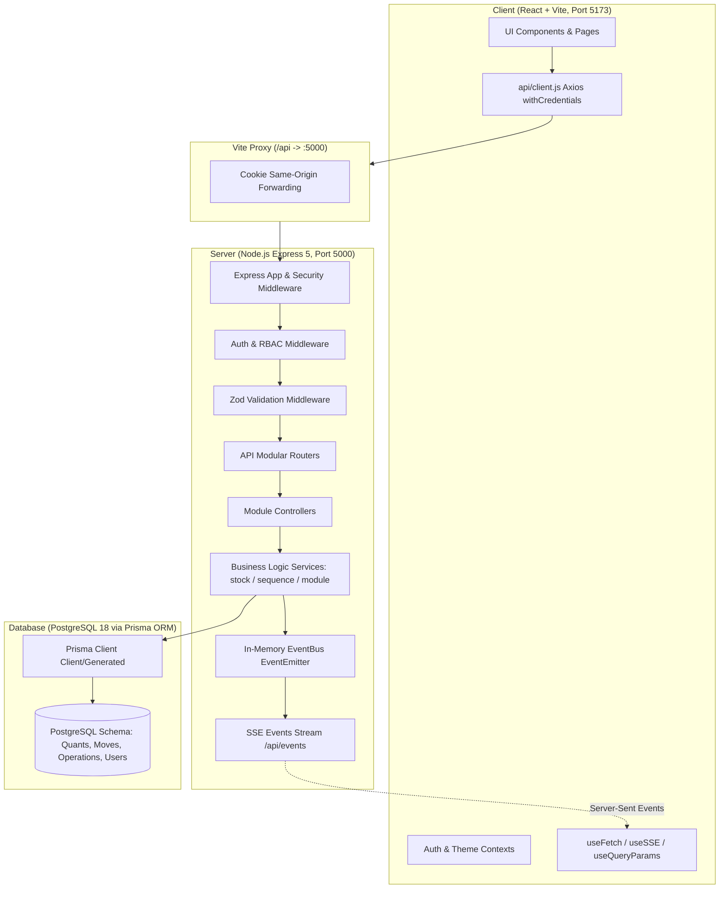
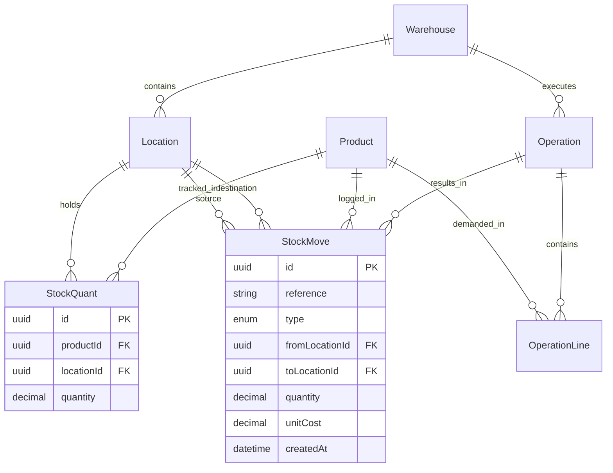
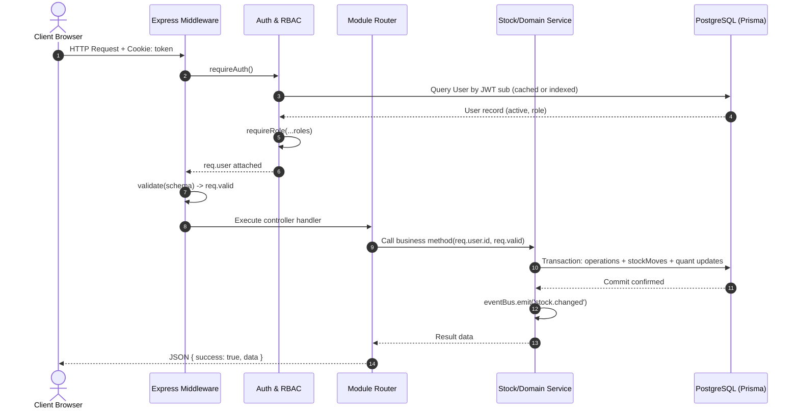

# StockSense — System Architecture & Technical Specifications

> **Document Version:** 1.0.0  
> **Status:** Canonical Architecture Specification  
> **Authors:** Member 1 (Lead & Foundation)

---

## 1. System Overview & Architecture Diagram

StockSense is structured as an enterprise-grade client-server monorepo with strict separation of concerns, double-entry stock integrity, and reactive real-time telemetry.



---

## 2. Backend Layering & Separation of Concerns

We enforce a strict 4-tier backend architecture:

1. **Routes Layer (`*.routes.js`):**
   - Declares REST paths, HTTP methods, and attaches middleware.
   - Binds `requireAuth`, `requireRole(...)`, and `validate({ body, query, params })`.
   - Never contains business logic or direct DB calls.
2. **Controller Layer (`*.controller.js`):**
   - Extracts validated parameters from `req.valid` (Express 5 safe), session user from `req.user`, and route params.
   - Delegates execution to the corresponding Service function.
   - Formats responses using the standardized envelope: `res.json({ success: true, data, meta? })`.
3. **Service Layer (`*.service.js`):**
   - Contains 100% of domain business logic, data calculations, transaction boundaries (`prisma.$transaction`), and sequence allocation.
   - Enforces business invariant constraints (e.g. stock non-negativity, short-code uniqueness, soft-delete rules).
   - Emits system events to `eventBus` **only after** transaction commits.
4. **Data Access Layer (`lib/prisma.js`):**
   - Prisma client instance configured with PostgreSQL database URL.

---

## 3. Core Stock Model & Ledger Mechanics

StockSense adopts a strict double-entry inventory ledger inspired by enterprise ERP design:



### 3.1 Rules of the Stock Engine (`services/stock.service.js`)
1. **Physical vs. Virtual Locations:**
   - **INTERNAL Locations** (e.g. `WH/Stock`, `WH/Rack-A`): Physical locations residing within a warehouse. `StockQuant` tracks on-hand inventory exclusively for internal locations.
   - **Virtual Locations** (`Vendors`, `Customers`, `Inventory Adjustment`): Global logical counter-parties (`warehouseId: null`). Virtual locations **never** maintain `StockQuant` rows.
2. **Move Execution (`applyMoves`):**
   - When stock moves **from** an `INTERNAL` location: The engine executes an atomic conditional decrement:
     ```sql
     UPDATE "StockQuant" SET quantity = quantity - $qty
     WHERE "productId" = $prodId AND "locationId" = $fromId AND quantity >= $qty;
     ```
     If 0 rows were updated, an `InsufficientStockError` is thrown, rolling back the transaction. Stock can **never** become negative.
   - When stock moves **to** an `INTERNAL` location: Upsert increment is executed.
   - Every movement generates an immutable `StockMove` record with unit cost, timestamp, and responsible user.
3. **Availability & Reservations:**
   - **On Hand:** Total physical inventory present in internal locations (`sum(StockQuant.quantity)`).
   - **Reserved:** Stock committed to operations in `READY` status waiting for final dispatch (`sum(OperationLine.quantity)` where `status = READY` and `sourceLocation = internal`).
   - **Free to Use:** Dynamic formula: $\text{Free to Use} = \max(0, \text{On Hand} - \text{Reserved})$.

---

## 4. Operation State Machines

Each operational document follows a validated state progression:

```mermaid
stateDiagram-v2
    [*] --> DRAFT : Creation

    state "Receipt Workflow" as ReceiptFlow {
        DRAFT --> READY : "To Do" (Confirmed)
        READY --> DONE : "Validate" (Apply Moves: Vendors -> Internal)
        DRAFT --> CANCELED : "Cancel"
        READY --> CANCELED : "Cancel"
    }

    state "Delivery Workflow" as DeliveryFlow {
        DRAFT --> WAITING : "Check Availability" (Stock shortage)
        WAITING --> READY : Stock arrives & Reserved
        DRAFT --> READY : Stock available (Reserved)
        READY --> DONE : "Validate" (Apply Moves: Internal -> Customers)
        DRAFT --> CANCELED : "Cancel"
        WAITING --> CANCELED : "Cancel"
        READY --> CANCELED : "Cancel" (Frees reservations)
    }

    state "Internal Transfer Workflow" as TransferFlow {
        DRAFT --> READY : Confirmed & Stock Reserved
        READY --> DONE : "Validate" (Apply Moves: Internal -> Internal)
        DRAFT --> CANCELED : "Cancel"
        READY --> CANCELED : "Cancel"
    }

    state "Inventory Adjustment Workflow" as AdjustmentFlow {
        DRAFT --> DONE : "Apply Count" (Immediate Moves: Internal <-> Adjustment)
    }
```

---

## 5. Security & Request Lifecycle



### 5.1 Real-Time Server-Sent Events (SSE) Flow
- Endpoint: `GET /api/events` (HTTP streaming, auth required).
- EventBus channels: `stock.changed`, `operation.changed`, `notification.created`.
- Server sends automatic ping heartbeat (`: heartbeat\n\n`) every 25 seconds to preserve TCP keep-alive behind proxies and load balancers.
- Client hook `useSSE(eventName, handler)` manages reconnects and state refreshes automatically.

---

## 6. Frontend Routing & State Model

StockSense avoids monolithic global stores (like Redux or Zustand) in favor of lightweight, native React patterns:
1. **Server State:** Handled via custom hook `useFetch(fetcherFn, deps)` with caching, refetch triggers, and error boundaries.
2. **Session State:** Provided globally by `AuthContext` (`user`, `login`, `logout`, `hasRole`).
3. **Theme State:** Provided globally by `ThemeContext` (`light`, `dark`, `system`), synchronized to `localStorage` and `document.documentElement.classList`.
4. **URL as State:** Deep linking via query parameters managed by `useQueryParams`:
   - `?search=...` (text search filter)
   - `?status=...` (`DRAFT`, `WAITING`, `READY`, `DONE`, `CANCELED`)
   - `?warehouseId=...` (warehouse filter)
   - `?locationId=...` (location filter)
   - `?late=true` (filters for late operations)
   - `?view=list|kanban` (view toggle)
